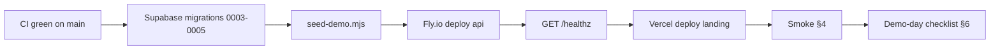

# DEPLOY.md

Operational handbook for ione (Margin AI Tutor). Sections grow over the final two phases — Phase 6 / I4 establishes the manual end-to-end smoke checklist; Phase 7 / J5 fills in launch + rollback + demo-day procedure.

---

## 1. Manual E2E checklist (Phase 6 / I4)

Run this before every demo and after every nontrivial deploy. Total wall-clock time ≈ 4 minutes if everything works; 10 minutes if you have to debug.

### 1.0 Prerequisites

- [ ] You are on Chrome ≥ 120 on macOS or Windows. Safari and Firefox are out of scope.
- [ ] iPad (or second screen) is mirrored into a screenshare-eligible window via QuickTime, Sidecar, or Reflector.
- [ ] You are logged into the demo account (or any owner-scoped account) at the same origin as `VITE_API_URL` is configured for (cookies + RLS depend on it).
- [ ] The API health check is green: `curl https://<api-host>/healthz` returns `{"ok":true}`.
- [ ] `STORE_FRAMES=1` is set on the API only if you intend to verify replay images at step 1.5; otherwise leave it off to save Supabase storage.

### 1.1 Capture starts (≤ 30s)

- [ ] Navigate to `/tutor`. Banner does NOT show "use Chrome 120+".
- [ ] Click "Start session". `getDisplayMedia` prompt appears.
- [ ] Pick the iPad-mirror window. Preview frame paints in the workspace area.
- [ ] On the first frame you can drag a ROI rectangle around the working area. Confirm the crop lands on the page, not the screen edges.
- [ ] DevTools → Network shows a 200 from `POST /api/sessions/start` with a `session_id` in the body.
- [ ] DevTools → Network shows the first `POST /api/cycle` lighting up with a multipart frame and `text/event-stream` response.

### 1.2 Frame posts → ribbon updates (≤ 8s)

- [ ] Within 8 seconds of the first frame, the Confidence Ribbon (left side, 12px wide) shifts color from initial `graphite` to either `moss` (clean) or `sienna` (concern).
- [ ] An SSE `confidence` event is visible in the network panel (event-stream tab).
- [ ] If `import.meta.env.DEV`, the Cost Meter shows a non-zero USD value for the cycle.

### 1.3 Hint card slides in on confusion (≤ 2 cycles after slip)

- [ ] Deliberately introduce a sign error or skip a step on the iPad page.
- [ ] Within 2 cycles (≤ 16s), a hint card slides into the right margin (Caveat font, ≈ -1.5deg rotation, hand-drawn underline).
- [ ] The hint references the actual error or predicted next-step risk — not generic encouragement.
- [ ] Stack does not exceed 3 cards visible at once. Old cards fade after ≈ 6s.

### 1.4 Audio plays (≤ 1s after hint)

- [ ] Audio playback begins automatically right after the card mounts (MediaSource path, ElevenLabs MP3 chunks).
- [ ] If audio fails to start, the card still shows; reload and re-test (MSE has occasional Chrome quirks). Fallback `<audio src=blobUrl>` should kick in within 4s.
- [ ] Volume is reasonable; the hint is intelligible.

### 1.5 Memory inspector reflects the cycle (≤ 60s)

- [ ] Open `/dashboard/memory` in a second tab.
- [ ] A new claim with `made_sign_error` (or whichever predicate the slip implied) appears in the right category. Provenance shows `session_id` + `cycle_id` and `predicted=true` if it came from the predictive agent.
- [ ] Realtime worked: the claim arrived without you hitting refresh.
- [ ] If `STORE_FRAMES=1`, open `/dashboard/sessions/<id>` and confirm replay scrubber shows real WebP images per cycle, not placeholders.

### 1.6 Upload a transcript → claims appear (≤ 30s)

- [ ] In another tab, navigate to `/dashboard/sources` and upload a synthetic transcript PDF (or use `scripts/fixtures/sample-transcript.pdf` if seeded).
- [ ] Within 30 seconds, the source detail page shows ≥ 5 claims, each with a chunk citation.
- [ ] Realtime: the new claims also surface in `/dashboard/memory` without manual refresh.
- [ ] At least one high/medium-sensitivity claim shows up in `/dashboard/memory` Proposal Review with confirm/reject buttons.

### 1.7 Next session uses memory

- [ ] End the current session ("Stop" button or close the screenshare).
- [ ] Confirm `tutor_sessions.ended_at` is set: open `/dashboard/sessions` and the session is no longer marked active.
- [ ] Start a NEW session on the same problem. Within 1-2 cycles, the hint card content reflects the struggle profile from §1.5/§1.6 (e.g. "watch the sign — you've slipped on this before").
- [ ] Edit one claim in `/dashboard/memory` (e.g. mark `made_sign_error` as resolved). On the next intervention beat, confirm the hint phrasing has changed accordingly.

### 1.8 Failure modes — rehearse the recovery

- [ ] Cost guardrail: temporarily set `COST_CAP_USD_PER_SESSION=0.01`, start a session, confirm a `cost_exceeded` toast appears and the UI degrades gracefully (no crash, ribbon goes silent).
- [ ] Concurrent session lock: open `/tutor` in two tabs as the same user, click Start in both. Second tab shows the "session already active" toast.
- [ ] SSE drop: kill the API mid-cycle. The toast/banner system surfaces a "lost connection" message and the ribbon stalls without throwing.
- [ ] Stage failsafe: navigate to `/tutor?mode=video`. The pre-recorded `public/demo-backup.mp4` plays. Audio is intact.

### 1.9 Sign-off

- [ ] All boxes above are checked.
- [ ] `pnpm eval` (from repo root) reports ≥ 13/15 orchestrator scenarios and 4/4 KG extractor scenarios green.
- [ ] Latest commit hash + checklist pass-time recorded in the team channel.

---

## 2. Supabase migration + seed (Phase 7 / J3)

The schema lives in `supabase/migrations/`. Apply in numeric order. All five
migrations are idempotent — running twice is safe.

| File | What it adds | When |
|---|---|---|
| `0001_profiles.sql` | onboarding profile, grade/class/topics enums, RLS | initial provisioning |
| `0002_knowledge_graph.sql` | source_files, chunks, claims, entities, events | initial provisioning |
| `0003_tutor_sessions.sql` | tutor_sessions/cycles/hints + page_state/step_status enums + one-active-session-per-user partial unique index | **Phase 7 / J3** |
| `0004_claim_provenance.sql` | claim provenance columns (extractor_name, model, session_id, cycle_id, predicted) + composite index | **Phase 7 / J3** |
| `0005_session_frames_storage.sql` | private `session-frames` bucket + RLS so STORE_FRAMES=1 can persist WebPs | optional, only when replay images are wanted |

### 2.1 Apply migrations

Pick one path:

**Path A — Supabase Dashboard (zero-CLI, recommended for first prod apply)**

1. Open [Supabase → SQL Editor](https://supabase.com/dashboard/project/_/sql).
2. For each file in order, paste the contents and click **Run**. Watch the
   bottom panel for green check; any red error means stop and report.
3. After 0003, sanity-check: `select count(*) from public.tutor_sessions;`
   returns 0 (empty) and the partial index exists:
   `select indexname from pg_indexes where indexname = 'uq_tutor_sessions_one_active_per_user';`
4. After 0004, confirm provenance columns:
   `select column_name from information_schema.columns where table_name='claims' and column_name in ('extractor_name','model','session_id','cycle_id','predicted');` → 5 rows.
5. Apply 0005 only if STORE_FRAMES will be on in this environment.

**Path B — supabase CLI (recommended once linked)**

```bash
supabase link --project-ref <ref>
supabase db push
```

`db push` walks `supabase/migrations/` and applies anything the remote is
missing. The migrations are written so it never re-creates an existing
type, table, or index.

### 2.2 Seed the demo account

The orchestrator references "this student has slipped on signs before" — that
context comes from a hand-authored memory graph the demo account ships with.
`scripts/seed-demo.mjs` is idempotent.

```bash
# from repo root
DEMO_USER_EMAIL=demo@ione.app pnpm seed-demo
```

What it writes (12 confirmed claims, 1 source_file, 3 chunks, 1 events row,
all tagged with `seed_demo_planted` for traceability):

- error patterns: `made_sign_error` ×3, `confused_concept` ×1
- topic mastery: `weak_at` factoring + radicals; `strong_at` linear systems
- preferences: `prefers_concise_hints`, `hint_voice=true`
- recent score: `score_below_average` on the most recent failed exam
- profile fact: `current_class = algebra_2`

Verify in `/dashboard/memory`: claims grouped by category should populate
within 1 second of opening the page.

To start fresh:

```bash
DEMO_USER_EMAIL=demo@ione.app pnpm seed-demo:reset
DEMO_USER_EMAIL=demo@ione.app pnpm seed-demo
```

### 2.3 Required secrets

Set on the API host (e.g. `flyctl secrets set --app ione-api KEY=value`):

| Secret | Source | Notes |
|---|---|---|
| `SUPABASE_URL` | Supabase project settings | https://\<ref\>.supabase.co |
| `SUPABASE_SERVICE_ROLE_KEY` | Supabase API settings | server-only; bypasses RLS |
| `SUPABASE_ANON_KEY` | Supabase API settings | only used for JWT verification |
| `ANTHROPIC_API_KEY` | console.anthropic.com | Sonnet for OCR + reasoning + extractors |
| `MATHPIX_APP_ID` | mathpix.com | optional; OCR fallback when present |
| `MATHPIX_APP_KEY` | mathpix.com | optional |
| `ELEVENLABS_API_KEY` | elevenlabs.io | TTS for hint audio |
| `ELEVENLABS_VOICE_ID` | elevenlabs.io | voice handle |

Non-secret env (already in `fly.toml`):
`NODE_ENV`, `PORT`, `LOG_LEVEL`, `ALLOWED_ORIGINS`,
`COST_CAP_USD_PER_SESSION`, `COST_CAP_USD_PER_USER_DAY`, `COST_CAP_USD_BUILD`,
`STORE_FRAMES`.

---

## 3. Launch

The launch order is non-negotiable: **DB before API before frontend**. Each
step has a verify gate; do not move on until the gate is green.



### 3.1 Pre-flight (T-30 min)

- [ ] On `main`, latest commit. `git status` clean.
- [ ] CI workflow `.github/workflows/ci.yml` green on the same SHA you intend to deploy. Verify with `gh run list --workflow=ci --limit=1` or open the Actions tab.
- [ ] `pnpm eval` ran locally within the last 24h with ≥ 13/15 orchestrator + 4/4 KG fixtures green. Reports live in `api/.eval/`. (Or trigger the manual `eval` workflow with reason="pre-launch".)
- [ ] You have these in `1Password` / your secrets vault — copy them into a scratch buffer, you'll paste them into `flyctl secrets set` shortly:
  - `ANTHROPIC_API_KEY`
  - `MATHPIX_APP_ID`, `MATHPIX_APP_KEY`
  - `ELEVENLABS_API_KEY`, `ELEVENLABS_VOICE_ID`
  - `SUPABASE_URL`, `SUPABASE_SERVICE_ROLE_KEY`, `SUPABASE_ANON_KEY`
- [ ] `flyctl auth whoami` resolves to your account. `vercel whoami` (or Cloudflare equivalent) is signed in.

### 3.2 Database (T-25 min)

Follow §2 in this document.

- [ ] Apply `0003_tutor_sessions.sql`, `0004_claim_provenance.sql`. Apply `0005_session_frames_storage.sql` only if you intend to enable `STORE_FRAMES=1`.
- [ ] Sanity queries from §2.1 all pass.
- [ ] `DEMO_USER_EMAIL=demo@ione.app pnpm seed-demo` completes with `12 claims planted` in stdout (alongside `1 source_file`, `3 chunks`, `1 event`).
- [ ] Open Supabase Table Editor → `claims`. Filter `user_id = <demo uid>`. Confirm 12 rows, all `provenance_tag = 'seed_demo_planted'`.

### 3.3 API → Fly.io (T-20 min)

```bash
cd api

# First time only:
flyctl launch --no-deploy --copy-config --name ione-api --region sea

# Push secrets (paste from your scratch buffer):
flyctl secrets set --app ione-api \
  ANTHROPIC_API_KEY="..." \
  MATHPIX_APP_ID="..." \
  MATHPIX_APP_KEY="..." \
  ELEVENLABS_API_KEY="..." \
  ELEVENLABS_VOICE_ID="..." \
  SUPABASE_URL="https://<ref>.supabase.co" \
  SUPABASE_SERVICE_ROLE_KEY="..." \
  SUPABASE_ANON_KEY="..."

# Deploy:
flyctl deploy --app ione-api --strategy rolling
```

Verify gates:

- [ ] `flyctl status --app ione-api` shows ≥1 machine in `started`/`passing`.
- [ ] `curl https://ione-api.fly.dev/healthz` returns `{"ok":true,"service":"ione-api","env":"production","time":"..."}` within 2s of cold start.
- [ ] `flyctl logs --app ione-api` shows `[server] listening on :8787` with no `[error]` lines from the last 60s.
- [ ] CORS smoke: `curl -i -X OPTIONS https://ione-api.fly.dev/api/sessions/start -H "Origin: https://ione.app" -H "Access-Control-Request-Method: POST"` returns `access-control-allow-origin: https://ione.app`.

> If `/healthz` works but a real request 500s with `SUPABASE_*` errors: secrets are missing or RLS is rejecting the service role. `flyctl secrets list --app ione-api` to verify, and confirm 0003/0004 actually applied.

### 3.4 Frontend → Vercel (T-10 min)

If first time:

```bash
cd landing
vercel link        # pick the team and an empty project, "ione"
vercel env add VITE_API_URL production         # paste https://ione-api.fly.dev
vercel env add VITE_SUPABASE_URL production
vercel env add VITE_SUPABASE_ANON_KEY production
```

Deploy:

```bash
vercel --prod
```

Verify gates:

- [ ] Vercel deployment URL returns 200 with the marketing page render.
- [ ] DevTools → Network: `https://ione-api.fly.dev/healthz` is reachable from the browser (CORS preflight passes).
- [ ] `https://ione.app/dashboard/memory` (after sign-in as demo user) shows the 12 seeded claims.

### 3.5 Verify (T-5 min)

- [ ] Run §4 smoke against the live URLs.
- [ ] Set `STORE_FRAMES=0` on Fly *unless* you've explicitly decided you want replay images for this event (`flyctl secrets set --app ione-api STORE_FRAMES=0`). Default is off to save Supabase storage and avoid unnecessary writes during a demo.
- [ ] Tag the deploy: `git tag deploy/$(date +%Y%m%d-%H%M)` and `git push --tags` so rollback can target a known-good ref.

---

## 4. Smoke

A 5-minute live verification you should run after every prod deploy and 30
minutes before every demo. The full §1 manual checklist is the gold standard;
this is the abbreviated form.

### 4.1 Liveness (≤ 30s)

- [ ] `curl https://ione-api.fly.dev/healthz` → `{"ok":true,...}`
- [ ] `curl -I https://ione.app` → 200. Static asset caching: `curl -I https://ione.app/assets/<any-hashed-asset>.js` shows `cache-control: public, max-age=31536000, immutable` (driven by `vercel.json` headers).
- [ ] Open Vercel deployment → no console errors on page load.

### 4.2 Auth + memory (≤ 60s)

- [ ] Sign in as `demo@ione.app` (Supabase magic-link or password depending on env).
- [ ] `/dashboard/memory` paints within 1s. Counts: 12 claims, 1 source.
- [ ] `/dashboard/sessions` is empty (or shows prior sessions; either is fine).

### 4.3 Tutor canary (≤ 90s)

- [ ] `/tutor?mode=demo` loads. No "use Chrome 120+" banner.
- [ ] Click Start, share the rehearsal iPad mirror, drag ROI.
- [ ] Within 8s, ribbon shifts off `graphite`. Within 16s of an intentional slip, a hint card slides in. Audio plays.
- [ ] Stop session. `/dashboard/sessions` shows the new row with `total_cycles ≥ 3`.
- [ ] `flyctl logs --app ione-api` from this 90s window: zero `[error]` lines, ≤ 1 `[warn]` (typically a transient SSE drop on stop).

### 4.4 Failsafe canary (≤ 30s)

- [ ] `/tutor?mode=video` plays `public/demo-backup.mp4` end-to-end. Audio is intact. This is the "if everything is on fire" path — verify it works *before* you need it.

If any box fails, stop and investigate. Don't go on stage with a yellow smoke.

---

## 5. Rollback

Three independent rollback levers, ordered from fastest to slowest. Use the
narrowest one that fixes the problem.

### 5.1 API only (typical: ≤ 90s)

```bash
flyctl releases --app ione-api
# pick the prior version number, e.g. v42:
flyctl releases rollback v42 --app ione-api
```

This re-pins the previous Docker image. No DB changes, no frontend changes.
Use when:

- a new agent prompt regressed the eval suite,
- a new env default broke cost guardrails,
- `/healthz` is green but real requests are 500ing.

After rollback, re-verify with §4.1 + §4.2.

### 5.2 Frontend only (typical: ≤ 60s)

Vercel UI: project → Deployments → previous green build → ⋯ → "Promote to
Production". Or CLI:

```bash
vercel rollback <previous-deployment-url> --prod --scope <team>
```

Use when:

- a Vite build chunked badly and the dashboard is blank,
- a Recharts/React 19 type fix broke at runtime even though tsc was happy,
- a new env var was deployed without a corresponding Fly secret.

### 5.3 Database (rare; deliberate)

The Supabase migrations are forward-only by convention. If you need to undo:

| Migration | Down procedure | Risk |
|---|---|---|
| `0005_session_frames_storage.sql` | `delete from storage.objects where bucket_id='session-frames';` then drop the bucket from Storage UI. | low — bucket is for replay only |
| `0004_claim_provenance.sql` | `alter table public.claims drop column extractor_name, drop column model, drop column session_id, drop column cycle_id, drop column predicted; drop index if exists idx_claims_session_cycle;` | medium — orchestrator writes will start failing the moment 0004 is gone; pair with API rollback |
| `0003_tutor_sessions.sql` | `drop table public.tutor_hints, public.tutor_cycles, public.tutor_sessions cascade; drop type page_state, step_status, hint_type, session_end_reason cascade;` | high — destroys all session history; only do this in a fresh prod where there's nothing to lose |

**Always API-rollback first**, then DB-rollback if absolutely necessary. The
service role key bypasses RLS, so if the API is on an old image and the DB is
on a new schema, you get partial-write corruption. API < DB temporal ordering
is the safe one.

### 5.4 Full restart

If you've lost faith in the deploy entirely:

```bash
# 1. API: roll to the last release before the bad one.
flyctl releases rollback <pre-bad-version> --app ione-api

# 2. Frontend: promote the last green Vercel deployment in the UI.

# 3. Tag the bad commit so you don't accidentally deploy it again:
git tag rollback/$(date +%Y%m%d-%H%M) <bad-sha>
git push --tags
```

Then write up what happened in the team channel before you forget. For the hackathon a three-line Slack message (what broke, what you rolled to, what to fix) is enough; a fuller post-mortem doc is post-demo work.

---

## 6. Demo-day checklist

Run this in order, on demo day. T-times are relative to your scheduled slot.

### 6.1 Hardware (T-2 hours)

- [ ] Demo laptop fully charged + power adapter packed.
- [ ] iPad fully charged + Apple Pencil charged + USB-C cable.
- [ ] HDMI / USB-C dongle for the stage.
- [ ] Spare USB-C cable in case yours breaks.
- [ ] Wired earbuds (in case stage audio fails — you can plug into the laptop and hold the mic to your earbud).
- [ ] Backup Wi-Fi: phone hotspot turned on, laptop already paired with it (don't rely on event Wi-Fi).

### 6.2 Software (T-30 min)

- [ ] Laptop on Chrome 120+. **One** profile with the demo account already signed in. Close every other tab.
- [ ] Permissions pre-granted on `https://ione.app`: screen capture, microphone, autoplay. Verify by opening `chrome://settings/content/all`.
- [ ] `https://ione.app/tutor?mode=demo` open in Tab 1. `https://ione.app/dashboard/memory` open in Tab 2 (so you can flip to it).
- [ ] `https://ione.app/tutor?mode=video` is bookmarked or in the URL bar history — your one-click failsafe.
- [ ] Run §4 smoke end-to-end. Sign-off in the team channel.
- [ ] Reset demo state: `DEMO_USER_EMAIL=demo@ione.app pnpm seed-demo:reset && pnpm seed-demo`. Confirm 12 claims in `/dashboard/memory`.
- [ ] iPad: page mirroring is up via QuickTime/Sidecar. The "Math Notebook" app is open to a fresh page.
- [ ] **Notification killers**: Slack/Discord/iMessage muted. macOS: Focus → Do Not Disturb. Hide the Dock if it'll show badge counts.

### 6.3 Stage flow — 5-minute beat sheet

The plan calls for a 5-minute beat sheet. Time-boxes are guidance, not gospel.

| Beat | Time | What you say | What you click |
|---|---|---|---|
| **Hook** | 0:00 – 0:30 | "Most AI tutors only react to wrong answers. ione watches the page and intervenes *before* the mistake compiles." | Slide 1 (cold open). |
| **Capture** | 0:30 – 1:00 | "Sharing my iPad. The system gets the page, not the keystrokes — that's important; it works on paper too." | Tab 1 → Start session, share iPad mirror, drag ROI. |
| **Clean cycle** | 1:00 – 1:45 | "Watch the ribbon — it's tracking confidence in real time." | Solve the first sub-step cleanly. Ribbon stays moss. |
| **Caught slip** | 1:45 – 2:45 | "Now I'll deliberately blow a sign — like I would when I'm tired. Notice the hint *predicted* it." | Drop a sign on purpose. Hint card slides in within 16s. Audio plays. |
| **Memory** | 2:45 – 3:30 | "Every cycle becomes long-term memory. This is *why* it predicted: the demo account has slipped on signs four times before." | Flip to Tab 2 (`/dashboard/memory`). Point at `made_sign_error` claims. |
| **Upload** | 3:30 – 4:15 | "I can also feed it a transcript or last week's exam. Watch — these are extracted claims, each citing the chunk it came from." | Flip to `/dashboard/sources`, drop a sample exam PDF, point at the new claims streaming in. |
| **Closing** | 4:15 – 5:00 | "It's the first AI tutor that gets *better at you* over time. Seeded with two prior chats and one exam, it predicted the slip in cycle three of session one. Thank you." | Slide 2 (architecture diagram). |

### 6.4 In-flight contingencies

If the live capture flakes:

- **Cold start spike (first cycle is slow)**: keep talking, the second cycle is always fast. Buy time with: "this is the 2-second cold start the audience never sees in production".
- **Hint card never appears**: ribbon should still be moving. Talk over it for one cycle, then say "let me make it more obvious" and drop a sign you've already rehearsed.
- **Audio doesn't play**: the card itself is the demo. "Audio is generated by ElevenLabs — there's a transcript on the card."
- **Whole tutor is wedged**: F5 to refresh once. If still wedged, navigate to `/tutor?mode=video`. Tell the audience "this is the rehearsal recording — the demo *did* run, you can verify the same flow in the dashboard at `/dashboard/sessions`."
- **Internet dies**: hotspot from §6.1. ione is cloud-dependent (Anthropic, Supabase, ElevenLabs); there is no offline mode. If hotspot also fails, fall back to `?mode=video`.

### 6.5 Post-demo (T+5 min)

- [ ] `flyctl logs --app ione-api` from the demo window: capture any error lines for the post-mortem.
- [ ] Note the eval cost: `flyctl status --app ione-api` shows machine uptime; cross-reference with Anthropic console spend.
- [ ] Reset the demo account if the next presenter is sharing this Supabase project: `pnpm seed-demo:reset`.
- [ ] Update CHANGELOG.md with whatever you shipped between rehearsal and live.

---

## 7. Reference

- Master plan (the source of truth this doc implements): see `~/.cursor/plans/why_this_shape_*.plan.md` or the version pinned to the demo-day commit.
- Migrations: [`supabase/migrations/`](supabase/migrations/).
- API entry: [`api/src/server.ts`](api/src/server.ts). Cost guardrails: [`api/src/lib/cost.ts`](api/src/lib/cost.ts).
- Frontend entry: [`landing/src/main.tsx`](landing/src/main.tsx). Tutor route: [`landing/src/pages/Tutor.tsx`](landing/src/pages/Tutor.tsx).
- Eval harness: [`api/tests/eval/harness.ts`](api/tests/eval/harness.ts). Run with `pnpm eval`. Report: `api/.eval/summary.md`.
